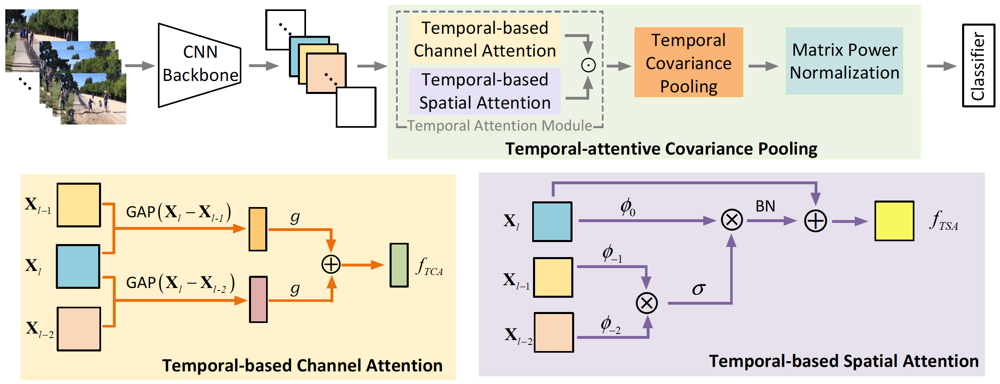

# Temporal-attentive-Covariance-Pooling-Networks-for-Video-Recognition
This is an implementation of [TCPNet][PAPER] (NeurIPS 2021).

[PAPER]: https://arxiv.org/pdf/2110.14381.pdf




## Introduction

For video recognition task, a global representation summarizing the whole contents of the video snippets plays an important role for the final performance. However,
existing video architectures usually generate it by using a simple, global average pooling (GAP) method, which has limited ability to capture complex dynamics
of videos. For image recognition task, there exist evidences showing that covariance pooling has stronger representation ability than GAP. Unfortunately, such
plain covariance pooling used in image recognition is an orderless representative, which cannot model spatio-temporal structure inherent in videos. Therefore, this
paper proposes a Temporal-attentive Covariance Pooling (TCP), inserted at the end of deep architectures, to produce powerful video representations. Specifi-
cally, our TCP first develops a temporal attention module to adaptively calibrate spatio-temporal features for the succeeding covariance pooling, approximatively
producing attentive covariance representations. Then, a temporal covariance pooling performs temporal pooling of the attentive covariance representations to char-
acterize both intra-frame correlations and inter-frame cross-correlations of the calibrated features. As such, the proposed TCP can capture complex temporal
dynamics. Finally, a fast matrix power normalization is introduced to exploit geometry of covariance representations. Note that our TCP is model-agnostic and
can be flexibly integrated into any video architectures, resulting in TCPNet for effective video recognition. The extensive experiments on six benchmarks (e.g.,
Kinetics, Something-Something V1 and Charades) using various video architectures show our TCPNet is clearly superior to its counterparts, while having strong
generalization ability.

## Citation

```
@article{gao2021temporal,
  title={Temporal-attentive Covariance Pooling Networks for Video Recognition},
  author={Gao, Zilin and Wang, Qilong and Zhang, Bingbing and Hu, Qinghua and Li, Peihua},
  journal={NeurIPS},
  year={2021}
}
  ```


  ## Model Zoo
  

#### Kinetics-400

  |Method | Backbone|frames|1 crop Acc (%)| 30 views Acc (%) | Model | Pretrained Model |  test log |
  |:-----:|:------:|:--:|:--------:|:--------:|:---------------------------------------:|:-----------------------------:|:---------------------:|
  |TCPNet |TSN R50 | 8f| 72.4/90.4 | 75.3/91.8| [K400_TCP_TSN_R50_8f][TCP_TSN8f_google] |[Img1K_R50_GCP][Img1K_R50_GCP] |  [log][TCP_R50_8f_log] |
  |TCPNet |TEA R50 | 8f| 73.9/91.6 | 76.8/92.9| [K400_TCP_TEA_R50_8f][TCP_TEA8f_google]|[Img1K_Res2Net50_GCP][Img1K_Res2Net50_GCP]|[log][TCP_TEA_R50_8f_log] |
  |TCPNet |TSN R152| 8f| 75.7/92.2 | 78.3/93.7| [K400_TCP_TSN_R152_8f][TCP_R1528f_google] |[Img11K_1K_R152_GCP][Img11K_1K_R152_GCP]|[log][TCP_R152_8f_log] |
  |TCPNet |TSN R50 |16f| 73.9/91.2 | 75.8/92.1| [K400_TCP_TSN_R50_16f][TCP_TSN16f_google] |[Img1K_R50_GCP][Img1K_R50_GCP]| [log][TCP_R50_16f_log] |
  |TCPNet |TEA R50 |16f| 75.3/92.2 | 77.2/93.1| [K400_TCP_TEA_R50_16f][TCP_TEA16f_google] |[Img1K_Res2Net50_GCP][Img1K_Res2Net50_GCP]|[log][TCP_TEA_R50_16f_log] |
  |TCPNet |TSN R152|16f| 77.2/93.1 | 79.3/94.0| [K400_TCP_TSN_R152_16f][TCP_R15216f_google] |[Img11K_1K_R152_GCP][Img11K_1K_R152_GCP]|[TODO][TCP_R152_16f_log] |
   
   
   [TCP_TSN8f_google]: https://drive.google.com/file/d/1p05CaIv50Y2hzELFD4tXYYCZXizjkKAr/view?usp=sharing
   [TCP_TSN16f_google]: https://drive.google.com/file/d/1tCg-1JiM8l0_lC_YCyBqeVY_BohiQ3PS/view?usp=sharing
   
   [TCP_TSN8f_baidu]: https://pan.baidu.com/s/1mXx3c0PWMB0rRerDK9wkBg
   [TCP_TSN16f_baidu]: https://pan.baidu.com/s/1ocj0-3V0HWbKwZm0nCHonQ
   
   [TCP_TEA8f_google]: https://drive.google.com/file/d/1YnYE9Jcrv7MXE-Uom0XqML-drSJ3kn1y/view?usp=sharing
   [TCP_TEA16f_google]: https://drive.google.com/file/d/1_NNRE1DEeghX9MvRi0-w3abmEE2dmxny/view?usp=sharing
   
   [TCP_TEA8f_baidu]: https://pan.baidu.com/s/1grKR6UWLVpQBrNHoaFNlJQ
   [TCP_TEA16f_baidu]: https://pan.baidu.com/s/1YfjpwcWWzxFYLS22f2OZ5Q
   
   [TCP_R1528f_google]: https://drive.google.com/file/d/108pRkpSOZ8uyaej_PYlkn2lfuOMWSl39/view?usp=sharing
   [TCP_R15216f_google]: https://drive.google.com/file/d/15A1OhUXE_5YRH_TS5H914_BHfsZgrMNd/view?usp=sharing
   [TCP_R1528f_baidu]: https://pan.baidu.com/s/10Or9C6R1GM6maRe6YL618w
   [TCP_R15216f_baidu]: https://pan.baidu.com/s/1sNdlxl9WBQN0jdpOHsOjWA
   
   [Img1K_R50_GCP]: https://drive.google.com/file/d/119Mu7xDm8mpBZhKje6hIV_ER6YXED5hv/view?usp=sharing
   [Img1K_Res2Net50_GCP]: https://drive.google.com/file/d/1SLNz3dmWVBVsdp9CIaWFZXcAgtG5DvTH/view?usp=sharing
   [Img11K_1K_R152_GCP]: https://drive.google.com/file/d/1FCx48L7KA9N4sh5ouH6Xp3GAQgEXE4so/view?usp=sharing
   
   [TCP_R50_8f_log]: https://drive.google.com/file/d/1oo0qoX184cGCu9flSd2r8hfy_HQJe4Rn/view?usp=sharing
   [TCP_TEA_R50_8f_log]: https://drive.google.com/file/d/1bQSs2MnuXEgVa-Yi1QYEThHUM7uv510G/view?usp=sharing
   [TCP_R152_8f_log]: https://drive.google.com/file/d/1cRYdgqP1OzrmwFJJAFnG7-TB2l6WuATz/view?usp=sharing
   [TCP_R50_16f_log]: https://drive.google.com/file/d/1hBy8PjOj5qHocGHvNES2nntJS0UpLryo/view?usp=sharing
   [TCP_TEA_R50_16f_log]: https://drive.google.com/file/d/1LIs77JXdsQGAhc_v4MleOws0o533pHwh/view?usp=sharing
   [TCP_R152_16f_log]: https://drive.google.com/file/d/1cRYdgqP1OzrmwFJJAFnG7-TB2l6WuATz/view?usp=sharing

     
   
#### Mini-Kinetics-200  


  |Method | Backbone|frames|1 crop Acc (%)| 30 views Acc (%) | Model | Pretrained Model |
  |:-----:|:------:|:--:|:--------:|:--------:|:---------------------------------------:|:-----------------------------:
  |TCPNet |TSN R50  |   8f   |    78.7   |        80.7       | [K200_TCP_TSN_8f][K200_TCP] | [K400_TCP_TSN_R50_8f][TCP_TSN8f_google]| 


[K200_TCP]: https://drive.google.com/file/d/1bbcBgfsxbzz6TdMm02RzrSqF0QyYbrLU/view?usp=sharing

  ## Environments
  
  pytorch v1.0+(for TCP_TSN); v1.0~1.4(for TCP+TEA)
  
  ffmpeg
  
  graphviz `pip install graphviz`

tensorboard `pip install tensorboardX`

tqdm `pip install tqdm`

scikit-learn `conda install scikit-learn`
  
matplotlib `conda install -c conda-forge matplotlib`

fvcore `pip install 'git+https://github.com/facebookresearch/fvcore'`

  ## Dataset Preparation
  
   We provide a detailed dataset preparation guideline for Kinetics-400 and Mini-Kinetics-200. See [Dataset preparation](Dataset.md).

  ## StartUp
  1. download the pretrained model and put it in `pretrained_models/`
  2. execute the training script file 
      e.g.: `sh script/K400/train_TCP_TSN_8f_R50.sh`
 3. execute the inference script file 
      e.g.: `sh script/K400/test_TCP_TSN_R50_8f.sh`
      
  ## TCP Code
 
  
```

├── ops
|    ├── TCP
|    |   ├── TCP_module.py
|    |   ├── TCP_att_module.py
|    |   ├── TSA.py
|    |   └── TCA.py
|    ├ ...
├ ...
```


  ## Acknowledgement

- We thank [TSM][1] for providing well-designed 2D action recognition toolbox.
- We also refer to some functions from [iSQRT][2], [TEA][3] and [Non-local][4].
- Mini-K200 dataset samplling strategy follows [Mini_K200][S3D]. 
- We would like to thank Facebook for developing pytorch toolbox.

Thanks for their work!
  
  [1]: https://github.com/mit-han-lab/temporal-shift-module
  [2]: https://github.com/jiangtaoxie/fast-MPN-COV
  [3]: https://github.com/Phoenix1327/tea-action-recognition
  [4]: https://github.com/facebookresearch/SlowFast
  [5]: https://pytorch.org
  [S3D]: https://github.com/s9xie/Mini-Kinetics-200
  
